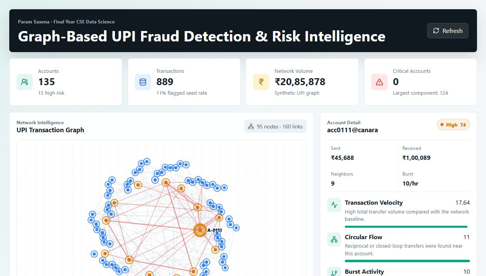

# Graph-Based UPI Fraud Detection & Risk Intelligence Platform

Built by **Param Saxena**  
Email: `param5saxena@gmail.com`

This is a final-year B.Tech CSE Data Science project that detects suspicious UPI transaction behavior using graph analytics, velocity signals, shared-device patterns, fraud-ring detection, and explainable risk scoring.

The project is intentionally built as a production-style full-stack system rather than a notebook-only ML demo.

## Preview



## What It Does

- Seeds a realistic UPI-like transaction network with benign users, merchants, mule accounts, smurfing, layering, and account-takeover patterns.
- Builds an account graph from sender-receiver transactions.
- Scores each account using explainable graph-risk signals.
- Visualizes high-risk UPI accounts and suspicious links on a network graph.
- Shows top risk reasons for every selected account.
- Provides an analyst queue, heatmap, case list, and real-time payment risk simulator.
- Exposes clean FastAPI endpoints for dashboard, graph, accounts, transactions, cases, and simulation.

## Tech Stack

**Backend**

- Python
- FastAPI
- SQLite
- Pydantic
- Deterministic graph-risk engine
- Pytest

**Frontend**

- React.js
- Vite
- Lucide React icons
- Responsive CSS dashboard
- SVG-based transaction graph visualization

## Project Structure

```text
UPI-Fraud-Risk-Intelligence-Platform/
|-- backend/
|   |-- app/
|   |   |-- api/
|   |   |-- core/
|   |   |-- db/
|   |   |-- schemas/
|   |   `-- services/
|   |-- storage/
|   |-- tests/
|   |-- .env.example
|   `-- requirements.txt
|-- frontend/
|   |-- public/
|   |-- src/
|   |   |-- api/
|   |   |-- components/
|   |   |-- utils/
|   |   |-- App.jsx
|   |   `-- index.css
|   |-- .env.example
|   `-- package.json
|-- docs/
|   `-- ARCHITECTURE.md
|-- sample_data/
|   `-- simulation_payload.json
|-- .gitignore
`-- README.md
```

## Quick Start

### 1. Backend

```bash
cd backend
python -m venv .venv
.venv\Scripts\activate
pip install -r requirements.txt
copy .env.example .env
uvicorn app.main:app --reload
```

Backend runs at:

```text
http://localhost:8000
```

API docs:

```text
http://localhost:8000/docs
```

### 2. Frontend

Open another terminal:

```bash
cd frontend
npm install
copy .env.example .env
npm run dev
```

Frontend runs at:

```text
http://localhost:5173
```

## Main API Endpoints

```text
GET  /health
GET  /api/overview
GET  /api/accounts?limit=80
GET  /api/accounts/{account_id}
GET  /api/transactions?account_id=ACC0111
GET  /api/graph?limit=95&minimum_score=18
GET  /api/heatmap
GET  /api/cases
POST /api/simulate
POST /api/admin/reset-seed
```

## Risk Signals

The scoring engine combines:

- Transaction velocity
- Graph centrality
- Fan-out behavior
- Shared device reuse
- Circular money flow
- Hourly burst activity
- Risky payment channels
- Known fraud exposure
- Geo-device mismatch
- Connected community size
- Weak KYC adjustment

## Suggested Viva Explanation

This system models UPI transactions as a directed graph where accounts are nodes and payments are edges. Fraud risk is not predicted from a single transaction only; it is inferred from network behavior. The project detects mule-ring behavior through circular flows, shared devices, burst transfers, risky payment channels, and rapid movement of funds across connected accounts.

## Future Enhancements

- Add supervised ML models trained on labelled transaction features.
- Add graph embeddings using Node2Vec or GraphSAGE.
- Integrate streaming ingestion with Kafka or Redis queues.
- Add analyst authentication and case lifecycle management.
- Add model drift monitoring and alerting.
