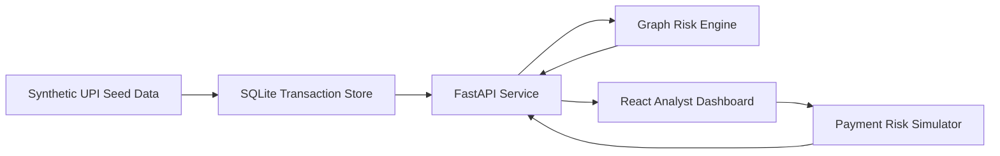

# Architecture

## System Overview

The platform is split into a FastAPI backend and a React dashboard.

## Backend Flow

1. `app.db.init_db` creates the SQLite schema.
2. `app.services.seed_data` inserts deterministic UPI-like accounts, transactions, fraud cases, and labelled suspicious patterns.
3. `app.services.risk_engine.GraphRiskEngine` builds in-memory graph indexes.
4. REST endpoints expose overview metrics, account scores, graph payloads, cases, heatmap data, and simulation decisions.

## Data Model

### accounts

Stores account identity, VPA, bank, city, KYC level, device fingerprint, and account type.

### transactions

Stores sender, receiver, amount, timestamp, channel, city, status, note, and label.

### risk_cases

Stores open analyst cases tied to high-risk accounts.

## Risk Engine

The engine creates these indexes:

- `outgoing`: account to outgoing transactions
- `incoming`: account to incoming transactions
- `neighbors`: undirected graph neighborhood
- `edge_counts`: directed transaction edge frequency
- `device_accounts`: device fingerprint to accounts
- `component_by_account`: connected component membership

The score is explainable and deterministic. Each signal has a value, a weight, and an explanation. The final score is mapped into:

- `Critical`: 75+
- `High`: 55-74
- `Medium`: 35-54
- `Low`: below 35

## Fraud Scenarios in Seed Data

- Benign merchant activity
- Smurfing into mule accounts
- Circular mule-ring layering
- Account takeover after device change
- Failed attempts mixed with successful transfers

## Why This Is Final-Year Level

- It uses graph-based behavioral modelling, not only row-level classification.
- It includes explainability, analyst workflow, simulation, and a full-stack dashboard.
- It is reproducible and deterministic for demos and evaluation.
- It can be extended into graph ML, streaming fraud detection, and MLOps monitoring.
